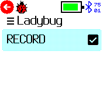
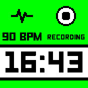
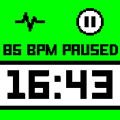

# Ladybug

This app is designed to collect heart rate and motion data for training machine learning algorithms in stress recognition. For more information about this project and our lab at Institut Pasteur in Paris, please visit our [webpage](https://research.pasteur.fr/en/project/autocomplete-using-wearables-and-ml-to-assist-subjects-with-autism-and-their-caretakers/).

Details on ethic approval:

## Usage

### Control Panel
Once you load the Ladybug app, you will see this panel, which allows you to control the status of data collection. 

### Widget
When set to recording, the app runs in the background to collect data. You will see a Ladybug widget in the top left corner of your watch if it is running.

Note: no data is collected when widgets are not loaded by other apps.

### Clockinfo
The app also includes a Clockinfo module that allows you to control the recording status. This means you can use it in combination with any clock app that supports the Clockinfo module.

For example, you can use this app with the Pebble++ clock to control data collection directly (see below).

## Requests & Creator
Please contact following creators for support/update requests. 

Hao Chen: 
- Email: hao.chen@cri-paris.org
- GitHub: [haochencoding](https://github.com/haochencoding)

Rajeev Mylapalli: 
- Email: rajeev.mylapalli@cri-paris.org
- GitHub: [rajeevmsn](https://github.com/rajeevmsn)
